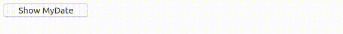

# Example 10.

## Introduction.

This example is intended to show the ability of StratusPHP to make calls to the browser at any time either to obtain values or just to do something in it.

It can be seen that when the page is loaded in the browser, an object of type `Date` is automatically created in the global object` window`. When this button is pressed, from the server a call will be made to the browser to obtain said value to later show it in a formatted way.

>We understand that this feature may create doubts respect his internal functionment. The StratusPHP functionment will be totally explained in a chapter of the documentation.

## Implementation.

```php
<?php
// src/MyPage.php

use ThenLabs\StratusPHP\FrontCall;
use ThenLabs\StratusPHP\Plugin\PageDom\Element;
use ThenLabs\StratusPHP\Plugin\SElements\AbstractPage;

class MyPage extends AbstractPage
{
    public function getView(): string
    {
        return <<<HTML
            <!DOCTYPE html>
            <html lang="en">
            <head>
                <meta charset="UTF-8">
                <meta name="viewport" content="width=device-width, initial-scale=1.0">
                <title>Document</title>
            </head>
            <body>
                <button s-element="myButton">Show MyDate</button>

                <script>
                    window.myDate = new Date();
                </script>
            </body>
            </html>
        HTML;
    }

    public function onClickMyButton(): void
    {
        $time = $this->executeScript("return window.myDate.getTime();", true);

        $dt = new \DateTime;
        $dt->setTimestamp($time / 1000);

        $label = Element::createFromString(
            "<label>{$dt->format('Y-m-d H:i:s')}</label>"
        );

        $this->querySelector('body')->prepend($label);
    }
}
```

## Result.

