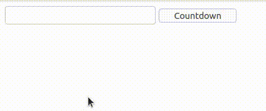

# Example 3.

## Introduction.

With this example we pretends show that StratusPHP sends messages to the browser by streaming, that is, the updates of the view they are produced instantment and not at the end of the asynchronous request.

It may see that in the cicle it is produced one second delay and in the same interval the label updates his value.

## Implementation.

```php
<?php
// src/MyPage.php

use ThenLabs\StratusPHP\Plugin\SElements\AbstractPage;

class MyPage extends AbstractPage
{
    public function getView(): string
    {
        return <<<HTML
            <!DOCTYPE html>
            <html lang="en">
            <head>
                <meta charset="UTF-8">
                <meta name="viewport" content="width=device-width, initial-scale=1.0">
                <title>Document</title>
            </head>
            <body>
                <input s-element="myInput" type="text">
                <label s-element="myLabel"></label>
                <button s-element="myButton">Countdown</button>
            </body>
            </html>
        HTML;
    }

    public function onClickMyButton(): void
    {
        $start = (int) $this->myInput->value;

        for ($i = $start; $i > 0; $i--) {
            $this->myLabel->textContent = $i;
            sleep(1);
        }

        $this->myLabel->textContent = 'End';
    }
}
```

## Result.

