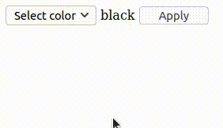

# Example 4.

## Introduction.

With this example we pretends show that with the `setStyle()` method of the elements it's possible sets the CSS properties of the elements of the page DOM.

## Implementation.

```php
<?php
// src/MyPage.php

use ThenLabs\StratusPHP\Plugin\SElements\AbstractPage;

class MyPage extends AbstractPage
{
    public function getView(): string
    {
        return <<<HTML
            <!DOCTYPE html>
            <html lang="en">
            <head>
                <meta charset="UTF-8">
                <meta name="viewport" content="width=device-width, initial-scale=1.0">
                <title>Document</title>
            </head>
            <body>
                <select s-element="select">
                    <option>Select color</option>
                    <option value="blue">blue</option>
                    <option value="red">red</option>
                    <option value="green">green</option>
                </select>
                <label s-element="label">black</label>
                <button s-element="button">Apply</button>
            </body>
            </html>
        HTML;
    }

    public function onClickButton(): void
    {
        $color = $this->select->value;

        $this->label->textContent = $color;
        $this->label->setStyle('color', $color);
    }
}
```

## Result.

