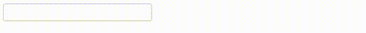

# Example 6.

## Introduction.

With this example we pretends show that with the help of the `ThenLabs\StratusPHP\Annotation\EventListener` it's possible specify the data of the event that will be need by the server.

When in the browser, it's introduced a character on the textbox, on it will be produced an `keypress` event wich will contains the `key` and `keyCode` data. The example show the way to specify the event data of the browser that will be need in the server for processing that event.

## Implementation.

```php
<?php
// src/MyPage.php

use ThenLabs\StratusPHP\Plugin\SElements\AbstractPage;
use ThenLabs\StratusPHP\Annotation\EventListener;

class MyPage extends AbstractPage
{
    public function getView(): string
    {
        return <<<HTML
            <!DOCTYPE html>
            <html lang="en">
            <head>
                <meta charset="UTF-8">
                <meta name="viewport" content="width=device-width, initial-scale=1.0">
                <title>Document</title>
            </head>
            <body>
                <input s-element="myInput" type="text">
                <label s-element="myLabel"></label>
            </body>
            </html>
        HTML;
    }

    /**
     * @EventListener(fetchData={"key", "keyCode"})
     */
    public function onKeypressMyInput($event): void
    {
        $eventData = $event->getEventData();

        $this->myLabel->textContent = "key: {$eventData['key']}, keyCode: {$eventData['keyCode']}";
    }
}
```

## Result.

